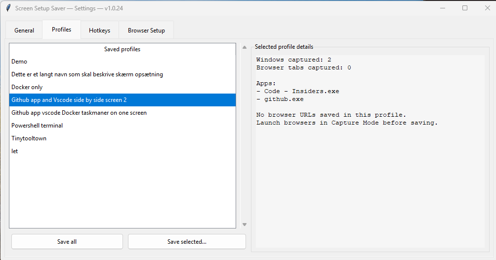

# 🖥️ Screen Setup Saver

> **Save your whole desktop in one click. Restore it just as fast.**

A Windows system-tray utility that remembers every open window — position, size, app — and even the browser tabs you had open. One hotkey saves your setup, another brings it all back.


---

## ✨ What it does

Ever spent five minutes getting your windows *just right* — docs on the left, browser on the right, terminal at the bottom — only to lose it all after a reboot? Screen Setup Saver fixes that.



- 📸 **Save layouts** — captures every visible window (position, size, maximized/normal state)
- 🔁 **Restore layouts** — relaunches closed apps and snaps everything back into place
- 🌐 **Browser tab capture** — saves Chrome and Edge tabs so they reopen on the right URLs
- 🗂️ **Named profiles** — "Work", "Gaming", "Meeting" — switch contexts in seconds
- ⌨️ **Global hotkeys** — `Ctrl+Alt+S` to save, `Ctrl+Alt+R` to restore (fully configurable)
- 🔕 **Runs in the tray** — zero window clutter, always there when you need it

---

## 🚀 Quick start

### Download the installer

Build the `.exe` installer with:

```powershell
.\build.ps1 -Version 1.0.24
```

Requires Python 3.11+ and optionally [NSIS](https://nsis.sourceforge.io/) for the installer wizard.

### Run from source

```powershell
pip install -r requirements.txt
.\run.bat
```

The app appears in the system tray. Right-click the icon to access all features.

---

## 📖 How to use

### Save a layout

| Method | Behaviour |
|---|---|
| `Ctrl+Alt+S` | Silently overwrites the last profile (or prompts for a name if none exists) |
| Tray → **Save layout** | Always asks for a profile name |
| Settings → **Save current layout** | Save all windows |
| Settings → **Save selected** | Pick exactly which windows to include |

### Restore a layout

| Method | Behaviour |
|---|---|
| `Ctrl+Alt+R` | Restores the last saved profile |
| Tray → **Restore layout** | Restores the last profile |
| Settings → Profiles list → **Restore** | Pick any saved profile |

Restore will relaunch apps that are no longer running and reposition any that are already open — no duplicates.

### Manage profiles

Open **Settings** (tray right-click). The **Profiles** tab lists all saved layouts. Right-click any profile to rename, delete, or view its saved apps and URLs.

### Configure hotkeys

**Settings → Hotkeys** tab. Type any combo supported by the [`keyboard`](https://github.com/boppreh/keyboard) library, e.g. `ctrl+shift+s`.

### Start with Windows

**Settings → General → Start with Windows**. Uses Windows Task Scheduler (no registry edits).

---

## 🌐 Browser tab capture

Capturing browser tabs requires launching Chrome/Edge with remote-debugging enabled:

1. Open **Settings → Browser Setup**
2. Confirm debug ports (defaults: Chrome `9222`, Edge `9223`)
3. Click **Launch Chrome in Capture Mode** and/or **Launch Edge in Capture Mode**
4. Click **Test browser capture now** — both should show **Connected**
5. Save your profile — tabs are now included

> Browsers launched this way open a separate debugging-enabled instance alongside any already-running browser.

---

## 📁 Where data is stored

```
%APPDATA%\ScreenSetupSaver\
  profiles\     ← saved layouts (JSON files, one per profile)
  config.json   ← hotkeys and browser port settings
  app.log       ← application log
```

---

## 🏗️ Project layout

```
main.py            Entry point, wires everything together
tray.py            System tray icon and menu
settings_ui.py     Settings window (tkinter)
capture.py         Window layout capture
browser.py         Browser tab capture via Chrome DevTools Protocol
restore.py         Profile restoration (relaunch + reposition)
profiles.py        Profile and config persistence
hotkeys.py         Global hotkey management
startup.py         Task Scheduler startup integration
build.ps1          Build script (PyInstaller → EXE, NSIS → installer)
installer/         NSIS installer script
assets/            App icon
tests/             Test suite (189 tests)
```

---

## 🛠️ Development

```powershell
pip install -r requirements.txt
pytest tests/ -v
```

---

## License

MIT — see [LICENSE](LICENSE).

